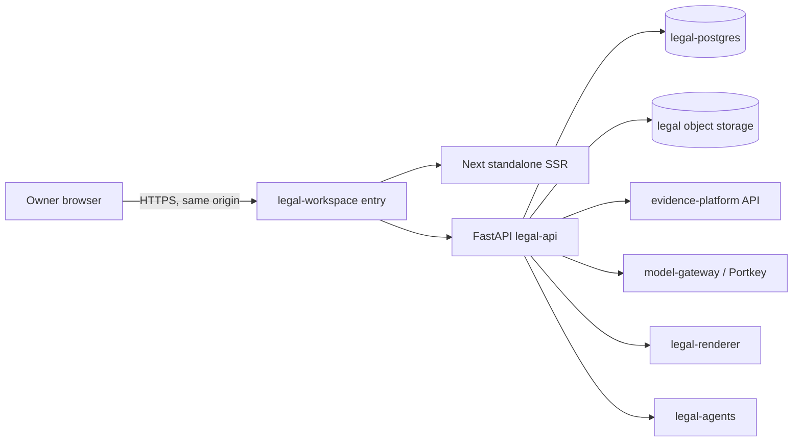

# Legal Workspace / Law Firm OS — Build and Integration Guide

> _Naming (D-138, 2026-09-05; applied 2026-09-06): this product is **advocatio** (formerly Legal-Workspace / Legal Workspace); the evidence platform it consumes is **Indicia Probata** / `probata` (formerly Agno-MCP-Platform). Directory: `probata/modules/advocatio/` (old name kept as a junction). GitHub repo name unchanged pending its own decision. Canon: `probata/docs/NAMING.md`. Historical text below is left verbatim; both names remain valid in recall stores (D-142)._


> **Version:** 0.1  
> **Date:** 2026-08-17  
> **Status:** Approved direction; pre-scaffold integration contract  
> **Byline:** Codex · GPT-5 · 2026-08-17  
> **Audience:** Owner, architects, implementation agents, and future contributors

## Answer first

Create a new sibling repository named `Legal-Workspace` beside `Agno-MCP-Platform`.

The existing platform remains the evidence truth system. The new Legal Workspace begins only after
evidence has been reviewed and accepted. It manages legal strategy, research, drafting, discovery,
deadlines, review, filing preparation, communications, and released work products.

```text
the-platform-workspace/
├── Agno-MCP-Platform/   # Evidence custody, knowledge, facts, horizons, investigations
└── Legal-Workspace/     # Legal analysis, strategy, drafting, review, filing preparation
```

The systems integrate through versioned, framework-neutral APIs and immutable source packages.
The Legal Workspace must never become a second writable evidence store.

## 1. Purpose and product boundary

```text
Evidence Platform                              Legal Workspace
-----------------                              ---------------
Custody and original sources                   Legal issues and theories
Normalized evidence records                    Michigan legal research
Reviewed claim investigations                  Private strategy and work product
Established facts                              Drafts, motions, briefs, discovery
Authored factual timeline                      Deadlines and hearing preparation
Approved evidence release package  ─────────►  Version-pinned legal source package
Evidence investigation request     ◄─────────  Missing-proof/contradiction request
```

### Evidence Platform owns

- Matter and CourtCase identity authority.
- Original sources, custody hashes, normalized records, chunks, and exact source spans.
- Evidence review state, established facts, assertion revisions, and source-family identity.
- The authored factual timeline and knowledge-horizon machinery.
- Evidence quarantine, revocation, correction, and supersession.
- Court-readiness facts about source material.

### Legal Workspace owns

- Legal issues, elements, claims, defenses, theories, objectives, and risks.
- Legal authority research and versioned authority snapshots.
- Private notes, strategy, research memoranda, outlines, and generated work products.
- Motions, responses, briefs, affidavits, proposed orders, discovery, subpoenas, exhibits,
  correspondence, hearing binders, and filing packages.
- Tasks, deadlines, hearings, service records, review decisions, and filing receipts.
- AI-assisted drafting and review runs, including model/provider/cost provenance.

### Boundary rules

1. Legal work cites accepted evidence through immutable references; it does not copy evidence into a
   second authored truth store.
2. A chunk, embedding hit, generated summary, or agent belief is not an established fact.
3. If legal work exposes a missing fact or contradiction, the Legal Workspace creates an
   `EvidenceInvestigationRequest` for the Evidence Platform.
4. Corrections create superseding versions. Released documents and accepted facts are never edited
   in place.
5. “Artifact” means a created work in this repository—draft, brief, exhibit package, or other legal
   work product. It must not be used to describe extracted evidence records.

## 2. Inherited platform constraints

These constraints are already settled by the platform and must remain compatible.

### Identity

- `Matter` is the enduring workspace.
- `CourtCase` is a specific proceeding within a Matter.
- One Matter may eventually contain multiple CourtCases.
- The initial owner experience auto-selects the sole friendly Matter and primary CourtCase.
- Raw UUID entry belongs only in advanced/debug views.
- `primary` is a Knowledge partition key, not a Matter or CourtCase ID.
- Legal records carry `matter_id` and, when proceeding-specific, `court_case_id`.

### Evidence and provenance

Every factual statement intended for release must resolve through:

```text
Work-product statement
  → accepted fact/assertion version
  → exact source span
  → normalized representation and chunk generation
  → custody-backed original
```

Every legal proposition must resolve through:

```text
Work-product proposition
  → authority citation and pinpoint
  → versioned authority snapshot
  → official/source URL and retrieval time
  → currentness and subsequent-history check
```

### Release and audit

- Draft does not mean court-safe.
- Owner approval creates a release decision; it never rewrites draft history.
- Review, approval, override, withdrawal, and supersession actions are append-only.
- Store timezone-aware absolute instants; display operator time in `America/New_York`.
- Public contracts use legal/platform vocabulary, not Agno or provider-specific runtime objects.
- Browser bundles never receive database, object-store, model-provider, or service credentials.

## 3. Recommended compatible stack

The new repository should match the platform where compatibility matters while allowing SSR.

### Frontend

| Area | Baseline |
|---|---|
| Framework | Next.js 16.3.1, App Router |
| UI runtime | React and React DOM 19.2.3 |
| Language | TypeScript 5, strict mode |
| Styling | Tailwind CSS 4 |
| Components | shadcn 3.8.4 and Radix UI 1.4.3 |
| Icons | Lucide |
| AI streaming | AI SDK 7.x and `@ai-sdk/react` 4.x |
| Node | 20 or newer |
| Packages | npm with committed lockfile and `npm ci` |

Use a hybrid delivery model:

- SSR/RSC for Matter dashboards, deadline summaries, document reading, release views, and initial
  data loads.
- Client components for editors, redlines, citation linking, comparison grids, drag-and-drop, and
  live agent activity.
- All domain mutations use versioned HTTP APIs. Next Server Actions must not become the only
  mutation path.
- Begin with Next `output: "standalone"`. A client-heavy/static experiment can consume the same APIs
  without forking domain behavior.

### Backend

| Area | Baseline |
|---|---|
| Language/runtime | Python 3.12 managed only with `uv` |
| API | FastAPI 0.141.x |
| Contracts | Pydantic 2.13.x |
| Persistence | PostgreSQL 18 |
| ORM/driver | SQLAlchemy 2.0.x and Psycopg 3.3.x |
| HTTP | httpx 0.28.x |
| Agent adapter | Agno 2.8.7 behind neutral interfaces |
| Model gateway | Existing Portkey service |
| Object storage | R2/S3-compatible storage |
| Observability | OpenTelemetry plus durable PostgreSQL run reports |

Required backend dependency direction:

```text
contracts → config → repositories → services → runtime/API
```

Agno, provider clients, legal-research vendors, document renderers, and delivery services remain
replaceable adapters.

### Proposed repository shape

```text
Legal-Workspace/
├── web/
│   ├── src/app/
│   ├── src/components/
│   └── src/lib/api/
├── api/
│   └── legal_workspace/
│       ├── contracts/
│       ├── domain/
│       ├── repositories/
│       ├── services/
│       ├── integrations/
│       ├── agents/
│       └── api/
├── sql/
├── tests/
├── docs/
│   ├── adr/
│   └── contracts/
├── compose.yaml
├── AGENTS.md
└── README.md
```

Do not add Nx, Turborepo, or another orchestration framework for the MVP.

## 4. System topology and networking



Recommended Tailscale service names:

| Responsibility | Service name |
|---|---|
| Browser-facing entry | `legal-workspace` |
| Next runtime | `legal-web` |
| Legal domain API | `legal-api` |
| Agent workers | `legal-agents` |
| Document renderer | `legal-renderer` |
| Legal PostgreSQL | `legal-postgres` |
| Existing platform API | `evidence-platform` |
| Existing model gateway | `model-gateway` |

Rules:

- Configuration uses service names, never embedded tailnet IPs.
- Only `legal-workspace` is browser-facing.
- Tailscale provides private routing and service identity; application authorization is still
  mandatory.
- No normal operator workflow requires an SSH tunnel.
- A future Go service may use `tsnet`/Tailscale Services for independent identity, but neutral HTTP
  contracts remain the integration boundary.

## 5. Integration contracts

### LegalSourcePackage

The Evidence Platform produces a version-pinned package containing only approved material:

- `package_id`, `schema_version`, and `manifest_hash`;
- `matter_id` and optional `court_case_id`;
- evidence corpus, selection, and policy revisions;
- accepted fact/assertion IDs and exact versions;
- exact span and custody locators;
- content hashes, review state, and authority status;
- permitted use, disclosure, and model-egress policy;
- creation time and originating run/trace IDs.

The Legal Workspace stores the package unchanged plus an authorized working cache. Package
revocation or source quarantine immediately marks dependent work products stale and blocks release.

### Minimum APIs

```http
GET  /v1/matters/{matter_id}
GET  /v1/matters/{matter_id}/court-cases
POST /v1/legal-source-packages
GET  /v1/legal-source-packages/{package_id}
GET  /v1/established-facts/{fact_id}/versions/{version}
POST /v1/citation-resolutions:batch
POST /v1/evidence-investigation-requests
GET  /v1/evidence-investigation-requests/{request_id}
```

Source-package creation accepts a bounded selection or immutable scope manifest, never arbitrary
browser-supplied SQL.

### Events from the Evidence Platform

- `evidence.release.approved.v1`
- `evidence.assertion.superseded.v1`
- `evidence.release.revoked.v1`
- `evidence.source.quarantined.v1`
- `matter.updated.v1`
- `court_case.updated.v1`

### Events from the Legal Workspace

- `legal.evidence_request.created.v1`
- `legal.work_product.review_requested.v1`
- `legal.work_product.released.v1`
- `legal.filing_package.ready.v1`
- `legal.deadline.changed.v1`

### Required event envelope

```json
{
  "event_id": "uuid",
  "event_type": "evidence.release.revoked.v1",
  "schema_version": "1.0",
  "occurred_at": "RFC3339 timestamp",
  "matter_id": "uuid",
  "court_case_id": "uuid-or-null",
  "aggregate_id": "uuid",
  "aggregate_version": 4,
  "trace_id": "string",
  "payload_hash": "sha256:...",
  "payload": {}
}
```

Producers use a transactional outbox. Consumers are idempotent by `event_id`, enforce aggregate
version order, support replay, and fail closed on unknown schema versions.

## 6. Core domain model

### Shared references

- `MatterRef`
- `CourtCaseRef`
- `LegalSourcePackage`
- `LegalSourcePackageItem`
- `EvidenceCitation`
- `EvidenceInvestigationRequest`

Matter and CourtCase references are local read-only projections of platform-owned identities.

### Legal reasoning

- `LegalIssue`
- `IssueElement`
- `ClaimOrDefense`
- `LegalTheory`
- `StrategyOption`
- `RiskAssessment`
- `ResearchQuestion`
- `ResearchMemo`

Every proposition retains an explicit epistemic class such as established fact, allegation,
inference, disputed assertion, legal theory, or legal conclusion. It cannot silently move between
classes.

### Authority

- `LegalAuthority`
- `AuthoritySnapshot`
- `AuthorityCitation`
- `AuthorityStatusCheck`

Each authority citation records jurisdiction, court, date, identifier, publication status,
pinpoint, source URL, retrieval time, content hash, subsequent history, and last currentness check.
A model's memory of a case, statute, rule, or form is never sufficient authority.

### Work product

- `WorkProduct`
- `WorkProductVersion`
- `DraftSection`
- `StatementSupport`
- `ReviewDecision`
- `ReleaseDecision`
- `FilingPackage`
- `FilingReceipt`

```text
private_draft
  → review_required
  → citation_verified
  → release_candidate
  → owner_approved
  → released
  → superseded or withdrawn
```

Editing creates a new version. It never mutates a released version.

### Operations

- `Task`
- `Deadline`
- `Hearing`
- `DocketEvent`
- `Communication`
- `AgentRun`
- `RunStage`
- `ModelInvocation`
- `AuditEvent`

## 7. Product surfaces

### P0 — Required foundation

#### Matter command center

- Friendly Matter/CourtCase identity with automatic single-case selection.
- Parties, children, court, judge, FOC, posture, governing orders, and upcoming events.
- Open issues, deadlines, tasks, reviews, evidence-package version, and staleness warnings.
- Persistent distinction between evidence, facts, allegations, theories, conclusions, and work
  products.

#### Issue, claim, and theory maps

- Issue trees for custody, parenting time, support, enforcement/contempt, discovery, protective
  relief, and procedure.
- Claim/defense elements, burdens, supporting and contradicting facts, missing proof,
  counterarguments, and likely opposing theories.
- Independent-source-family count shown separately from raw hit count.
- Every factual proposition linked to its exact accepted source.

#### MCL 722.23 factor workspace

- Separate analysis for all factors (a) through (l), not only favorable factors.
- For each factor: evidence for each parent, contradictions, neutral/ambiguous material, missing
  evidence, credibility risks, proposed findings, and citations.
- Conduct-first language. Diagnostic labels remain hypotheses unless supported by qualified
  evidence.
- Factor weighting and ultimate conclusions remain owner decisions.
- Versioned factor matrix reusable in briefs, hearing outlines, and custody summaries.

#### Legal research workspace

- Michigan jurisdiction profile by default.
- Statutes, Michigan Court Rules, published appellate authority, SCAO forms/instructions,
  court-specific requirements, and secondary sources separated by authority level.
- Research questions, plans, adverse authority, counterarguments, uncertainty, and unresolved
  questions.
- Currency monitoring for changed statutes, rules, forms, and administrative orders.
- Changed authority marks dependent drafts `revalidation_required`.

#### Drafting Studio

- Motions, responses, briefs, affidavits/declarations, proposed orders, discovery, subpoenas,
  witness outlines, settlement proposals, correspondence, and hearing binders.
- Template selection by proceeding, court, posture, and form revision.
- Paragraph-level evidence and authority support.
- Unsupported factual statements visibly marked `UNSUPPORTED`.
- Draft lineage, redlines, model/run metadata, reviewer comments, and immutable approved versions.

#### Exhibit and citation manager

- Exhibit candidates only from court-ready accepted evidence.
- Bates/exhibit number, source, foundation, custody, redaction, relevance, issues/factors,
  duplicate-family warnings, and objections/response notes.
- Exact quotation plus surrounding context.
- Separate technically ready, reviewed, and approved-for-use states.
- Deterministic export manifest with source and generated-file hashes.

#### Deadlines and filing readiness

- Calendar derived from orders, hearings, rules, service events, and owner-entered commitments.
- Each calculation stores its trigger, authority, explanation, assumptions, timezone, confidence,
  version, and human verification.
- Caption/case-number, signature/notary, current form, attachments, proposed order, redactions,
  confidential handling, formatting, fee/waiver, service, and proof-of-service checks.
- No autonomous filing or service.

#### Review and approval inbox

- Gates for research, facts/provenance, legal theory, draft, exhibits/redactions, and filing package.
- Approver identity, time, rationale, version hash, and overrides.
- Optional four-eye review for high-risk documents.
- Approval invalidates when a cited authority, evidence item, template, or deadline changes.

### P1 — High-value operations

#### Discovery workspace

- Interrogatories, requests for production, admissions, subpoenas, responses, objections,
  deficiencies, meet-and-confer history, and motion-to-compel readiness.
- Every request linked to an issue, element, contradiction, or missing proof.
- AI drafts; the owner controls scope, target, service, and use.

#### Negotiation and communications

- Objectives, acceptable terms, concessions, risks, costs, and alternatives.
- BIFF-style and court-safe communication drafting with tone/risk review.
- Offer/counteroffer and parenting-plan clause comparison.
- Private strategy separated from material intended for transmission.
- No autonomous sending.

#### Hearing and trial preparation

- Element/factor-to-proof matrix, witnesses, examination outlines, objections, impeachment
  packets, exhibit sequence, demonstratives, and requested relief.
- Simulated opposing argument and neutral judicial-question review.
- Hearing binder export with verified citations and provenance manifest.
- Post-hearing order comparison and compliance task generation.

#### Privacy and work-product controls

- Access by Matter, CourtCase, document, sensitivity, and purpose.
- Separate accepted evidence, generated work product, private strategy, communications,
  confidential/nonpublic content, and filing-ready public content.
- Redaction workspaces preserve originals and produce derivative redacted copies.
- Model-context, disclosure, download, and export audits.

### P2 — Later enhancements

- Scenario comparisons with explicit assumptions and uncertainty.
- Prompt and legal-template regression testing against reviewed gold documents.
- Model quality, latency, cost, and token comparison for legal tasks.
- Local-court adapters and form/rule revision watchers.
- Optional lawyer-review portal without changing the pro se ownership model.
- Strictly isolated reusable legal-research library with no case-fact leakage.

## 8. Agent roles and automation boundaries

Initial narrow agents:

- Legal intake and issue spotter.
- Michigan-law research assistant.
- Evidence-to-element mapper.
- Drafting assistant.
- Citation verifier.
- Adversarial/red-team reviewer.
- Discovery assistant.
- Filing-readiness checker.

Each run records requested and effective provider/model, fallbacks, cost, tool calls, input-package
hash, output hashes, and review status.

The system must never autonomously:

- Establish a fact, authenticate evidence, or approve material for legal use.
- Select ultimate strategy, requested relief, admissions, concessions, or settlement terms.
- Assign dispositive weight to custody factors or issue an unqualified custody recommendation.
- Diagnose a person or convert behavioral analysis into a court-facing fact.
- Remove adverse authority, unfavorable evidence, contradictions, or uncertainty.
- Sign, notarize, file, serve, email, publish, or transmit material externally.
- Issue discovery/subpoenas or contact courts, FOC, parties, counsel, witnesses, experts, schools,
  providers, or agencies.
- Claim privilege, work-product protection, confidentiality, admissibility, or compliance as a
  settled legal conclusion.
- Expose protected data to a model without an approved purpose and egress policy.
- Reuse one Matter's facts, embeddings, prompts, or drafts in another Matter.
- Overwrite an approved or released document.

The product must not present AI conversations as attorney-client privileged. Privilege and
work-product labels are human-asserted claims recording basis, scope, author, recipients, waiver
risk, and review state.

## 9. Data separation

Recommended disclosure classifications:

```text
public
case_confidential
private_strategy
work_product_claimed
privilege_claimed
release_approved
```

Each claim records who asserted it, its basis, assertion time, review state, waiver/release state,
and superseding decision.

Recommended logical boundaries:

| Boundary | Contents |
|---|---|
| `legal_core` | Matter refs, cases, tasks, deadlines, filing metadata |
| `legal_research` | Authorities, snapshots, research questions |
| `legal_work_product` | Strategy, drafts, memos, prompts, generated output |
| `legal_release` | Owner-approved manifests and released copies |
| `legal_audit` | Append-only actions and payload hashes |

Use separate PostgreSQL roles and object-store prefixes. The export worker reads only approved
release material. Agent workers cannot approve release.

Prompts, private notes, traces, chain-of-thought, rejected drafts, and strategy annotations must
never enter a court export.

## 10. Phased delivery

### Phase 0 — Contracts and skeleton

- Scaffold repository, quality gates, nested `AGENTS.md`, and deployment.
- Lock Matter/CourtCase reference contracts.
- Lock source-package, citation, event, and audit contracts.
- Establish same-origin authentication and Tailscale service names.
- Generate TypeScript clients from OpenAPI.

### Phase 1 — Usable legal drafting MVP

- Matter Home with automatic single-Matter/CourtCase selection.
- Import an approved LegalSourcePackage.
- Issue/element and MCL 722.23 factor workspaces.
- Evidence-linked Markdown drafting.
- Evidence citation resolver.
- Immutable versions, review decisions, and release blocking.
- DOCX/PDF release candidate and deterministic manifest.

### Phase 2 — Research and court work

- Legal-research adapter framework.
- Versioned authority snapshots and currentness checks.
- Pleading, motion, brief, affidavit, discovery, and proposed-order templates.
- Discovery workspace.
- Deadlines, hearings, tasks, and filing-readiness checks.

### Phase 3 — AI legal team

- Narrow agent roles and reviewed handoffs.
- Model/provider routing and comparison.
- Adversarial review and alternative-argument generation.
- Paragraph-level support maps.
- Durable reports, traces, cost, and approvals.

### Phase 4 — Operational integrations

- Communication-delivery adapters.
- Calendar integrations.
- Docket monitoring.
- Filing-portal assistance only after a separate security and legal-process review.
- Multi-case expansion only when an actual need exists.

## 11. Acceptance criteria

### AC-IDENTITY-001 — Friendly automatic scope

- **Given** the owner has one Matter and one active CourtCase
- **When** the Legal Workspace opens
- **Then** it selects and displays their friendly names without requesting a raw ID.

### AC-SOURCE-001 — Accepted evidence only

- **Given** a claim candidate has not been approved by the Evidence Platform
- **When** a LegalSourcePackage is created
- **Then** that candidate is excluded and the omission is recorded.

### AC-CITATION-001 — End-to-end factual provenance

- **Given** a factual sentence appears in a release candidate
- **When** the citation validator runs
- **Then** the sentence resolves to an exact accepted assertion version and custody-backed source
  span or release is blocked.

### AC-AUTHORITY-001 — Legal authority provenance

- **Given** a legal proposition appears in a release candidate
- **When** authority validation runs
- **Then** it resolves to a pinned authority snapshot and pinpoint with a currentness state or
  release is blocked.

### AC-REVOCATION-001 — Evidence changes propagate

- **Given** a released evidence package is revoked or a source is quarantined
- **When** the Legal Workspace consumes the event
- **Then** every dependent work product becomes stale and cannot be released until reviewed.

### AC-VERSION-001 — Released documents are immutable

- **Given** a work product has been released
- **When** a user edits it
- **Then** the system creates a new version and preserves the released version unchanged.

### AC-EXPORT-001 — Private material cannot leak

- **Given** a filing package contains private strategy, prompts, traces, rejected drafts, or
  privilege claims
- **When** export validation runs
- **Then** those materials are excluded and their inclusion blocks release until resolved.

### AC-AUTOMATION-001 — Agents cannot release or file

- **Given** an agent completes a legal workflow
- **When** it attempts to approve release, file, send, or mark a document filed
- **Then** authorization fails and an audit event records the denied action.

### AC-DEADLINE-001 — Deadline calculations are reviewable

- **Given** the system calculates a deadline
- **When** it displays the date
- **Then** it also displays the jurisdiction, trigger, rule source, inputs, timezone, calculation
  version, and human-confirmation state.

### AC-ROUTING-001 — AI runs are reproducible

- **Given** an AI-assisted run completes
- **When** its report is opened
- **Then** requested/effective model, provider, fallback, cost, input manifest, tool activity, and
  output hashes are visible.

### AC-DELIVERY-001 — SSR and client modes share contracts

- **Given** a workflow is opened in SSR or client-heavy delivery mode
- **When** it reads or mutates domain state
- **Then** both modes use the same versioned FastAPI contract and authorization rules.

### AC-NETWORK-001 — No address coupling

- **Given** a service moves to another tailnet host
- **When** its Tailscale service registration is updated
- **Then** callers continue using its stable service name without code changes or tunnels.

## 12. Explicit non-goals

- Reimplement evidence intake, custody, normalization, extraction, vectorization, or fact
  establishment.
- Create another canonical evidence graph or authored factual timeline.
- Permit browser-direct access to PostgreSQL, Weaviate, Neo4j, Graphiti, SurrealDB, or R2.
- Promote model output automatically into accepted fact.
- Make autonomous legal conclusions, privilege decisions, court releases, filings, service, or
  external communications.
- Build multi-client law-firm tenancy, billing, trust accounting, payroll, or CRM in the MVP.
- Silently expand scope from one Matter or CourtCase into another.
- Build a generic workflow designer before fixed legal workflows are proven.
- Use diagnostic labels as court-facing facts.
- Represent an AI agent as the attorney of record.

## 13. Decisions to make during repository initialization

These are initialization choices, not blockers to creating the repository:

1. Confirm the final repository/product name; `Legal-Workspace` is the working name.
2. Choose a separate PostgreSQL service versus isolated schemas/roles on the existing PG host.
3. Select Markdown-first, structured-document, or DOCX-first authoring.
4. Select the approved deterministic DOCX/PDF renderer.
5. Select legal-research providers and document licensing/retention rules.
6. Define provider-by-provider model-egress policy for confidential material.
7. Choose the first Michigan forms, motions, and proceeding types for the MVP.
8. Decide whether communication integrations remain draft-only through Phase 2.

## 14. First implementation slice

The first usable vertical slice should prove this path:

```text
Auto-selected Matter/CourtCase
  → import approved LegalSourcePackage
  → map one issue and its elements
  → build one MCL 722.23 factor entry
  → draft one evidence-linked motion section
  → validate factual and legal citations
  → perform owner review
  → export a deterministic release candidate plus manifest
```

Do not begin with a generic chat screen. The first screen should be the Matter command center, and
the first AI interaction should occur inside a scoped legal task with pinned evidence and authority.

## 15. Source decisions and companion documents

This guide inherits the current platform decisions and should be read with:

- [`Agno-MCP-Platform/docs/PROJECT_CANON.md`](Agno-MCP-Platform/docs/PROJECT_CANON.md)
- [`Agno-MCP-Platform/docs/PRODUCT-BLUEPRINT-2026-08-15.md`](Agno-MCP-Platform/docs/PRODUCT-BLUEPRINT-2026-08-15.md)
- [`Agno-MCP-Platform/docs/ARCHITECTURE-BLUEPRINT-2026-08-15.md`](Agno-MCP-Platform/docs/ARCHITECTURE-BLUEPRINT-2026-08-15.md)
- [`Agno-MCP-Platform/docs/adr/0054-durable-run-reports-and-correlated-observability.md`](Agno-MCP-Platform/docs/adr/0054-durable-run-reports-and-correlated-observability.md)
- [`Agno-MCP-Platform/docs/adr/0055-matter-and-court-case-identity-boundary.md`](Agno-MCP-Platform/docs/adr/0055-matter-and-court-case-identity-boundary.md)
- [`Agno-MCP-Platform/docs/adr/0057-claim-centered-evidence-assembly-and-established-facts.md`](Agno-MCP-Platform/docs/adr/0057-claim-centered-evidence-assembly-and-established-facts.md)
- [`Agno-MCP-Platform/docs/adr/0058-investigation-search-and-behavioral-analysis-modes.md`](Agno-MCP-Platform/docs/adr/0058-investigation-search-and-behavioral-analysis-modes.md)

When the new repository is created, copy this guide into its `docs/` directory, add a repository
specific `AGENTS.md`, and update the parent workspace orientation so it no longer says that
`Agno-MCP-Platform` is the only active build.

## Glossary

| Term | Meaning |
|---|---|
| Matter | Enduring owner workspace that may contain one or more proceedings |
| CourtCase | A specific court proceeding within a Matter |
| LegalSourcePackage | Immutable, approved, version-pinned evidence selection released to legal work |
| Established fact | Human-governed factual assertion in the Evidence Platform |
| Legal theory | A proposed application of law to facts; never automatically an established fact |
| Work product | A created legal artifact such as a draft, memorandum, exhibit set, or filing package |
| Release candidate | Reviewed version proposed for external or court use but not yet approved |
| EvidenceInvestigationRequest | Request sent back to the Evidence Platform for missing or contradictory proof |
| Authority snapshot | Version-pinned capture of a statute, rule, opinion, form, or other legal source |
| Court-safe | Human-approved for a specified use after provenance, legal, privacy, and formatting review |
